# 机票预定系统 (Air Ticket Reservation System)

[](https://opensource.org/licenses/MIT)
[](https://www.oracle.com/java/)
[](https://openjfx.io/)
[](https://www.mysql.com/)

一个基于 JavaFX 和 MySQL 的可视化机票预订管理系统。本系统是数据库综合训练项目，实现了完整的航班查询、机票预订、订单管理等功能。

## 📋 目录

- [项目概述](#项目概述)
- [系统特性](#系统特性)
- [系统架构](#系统架构)
- [运行环境](#运行环境)
- [安装指南](#安装指南)
- [使用说明](#使用说明)
- [数据库设计](#数据库设计)
- [系统截图](#系统截图)
- [测试](#测试)
- [许可证](#许可证)
- [参考文献](#参考文献)

## 📖 项目概述

本项目是一个完整的机票预订系统，采用 Java 平台开发，使用 JavaFX 框架构建现代化的图形用户界面，并通过 JDBC 连接 MySQL 数据库实现数据持久化。系统分为**用户端**和**管理端**两个子系统：

- **用户端**：用户可以查询航班信息、预订机票、管理订单、维护个人信息等
- **管理端**：管理员可以管理航班信息、用户信息、订单信息，进行系统数据的增删改查操作

### 主要功能模块

1. **航线管理**：航班信息的查询、添加、修改、删除
2. **乘客信息管理**：乘客信息的维护和管理
3. **订单管理**：机票预订、退订、订单查询
4. **个人中心**：用户个人信息管理、密码修改
5. **系统管理**：用户账号管理、权限控制

## ✨ 系统特性

### 用户端功能
- 🔍 **航班搜索**：支持按出发地、目的地、出发时间等条件搜索航班
- 🎫 **机票预订**：选择航班、添加乘客信息、完成预订
- 📋 **订单管理**：查看已购机票、支持退订操作
- 👤 **个人中心**：查看和修改个人信息、修改密码
- 🔐 **账号管理**：用户注册、登录、找回密码
- 👥 **多乘客支持**：支持一次为多位乘客预订机票

### 管理端功能
- ✈️ **航班管理**：航班信息的增删改查
- 👨‍✈️ **用户管理**：客户账号信息管理
- 📊 **订单管理**：查看所有订单、订单信息维护
- 🔄 **实时更新**：双击编辑，回车确认，操作简便快捷

### 技术特性
- 💫 **现代化 UI**：使用 JavaFX 实现，界面美观，支持鼠标动态反馈
- 🔒 **安全性**：用户和管理员账户分离存储，密码加密保护
- 📱 **响应式设计**：支持右键菜单快捷操作
- 🎯 **智能搜索**：支持完整信息搜索和部分信息模糊搜索
- ✅ **数据验证**：支持身份证号码验证（包含 X 结尾的情况）

## 🏗️ 系统架构

### 系统层次结构

```
机票预定系统
├── 表示层 (Presentation Layer)
│   ├── JavaFX UI 组件
│   └── FXML 界面描述
├── 业务逻辑层 (Business Logic Layer)
│   ├── 用户管理 (UserUtils)
│   ├── 航班管理 (FlightUtils)
│   ├── 订单管理 (OrderUtils)
│   └── 乘客管理 (PassengerUtils)
├── 数据访问层 (Data Access Layer)
│   └── JDBC 数据库连接 (MysqlUtils)
└── 数据层 (Data Layer)
    └── MySQL 数据库
```

### 总体系统组成

系统主要包含以下用户及其功能：
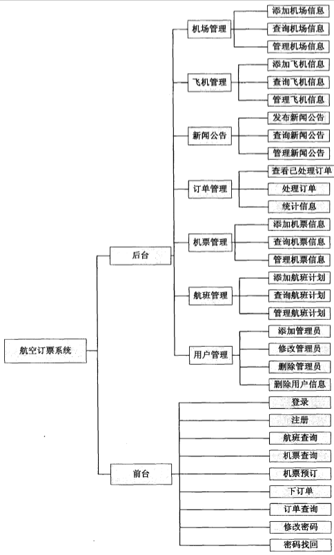

## 💻 运行环境

### 推荐配置

- **操作系统**：Windows / Linux / macOS
- **IDE**：IntelliJ IDEA Professional Edition (推荐 2023 版本)
- **JDK**：1.8.0_372 或更高版本
- **数据库**：MySQL 8.0.33 或更高版本
- **GUI 框架**：JavaFX (已包含在 JDK 8 中)

### 最低要求

- CPU：x86_64 架构处理器
- 内存：4GB RAM
- 磁盘空间：200MB

## 📦 安装指南

### 1. 环境准备

#### 安装 JDK 1.8
```bash
# Linux (Ubuntu/Debian)
sudo apt-get install openjdk-8-jdk

# macOS
brew install openjdk@8

# Windows
# 从 Oracle 官网下载并安装 JDK 1.8
```

#### 安装 MySQL 8.0
```bash
# Linux (Ubuntu/Debian)
sudo apt-get install mysql-server

# macOS
brew install mysql

# Windows
# 从 MySQL 官网下载并安装 MySQL 8.0
```

### 2. 获取项目

```bash
git clone https://github.com/longzheng268/Air-Ticket-Reservation-System.git
cd Air-Ticket-Reservation-System
```

### 3. 配置数据库

#### 创建数据库并导入数据
```bash
# 登录 MySQL
mysql -u root -p

# 创建数据库
CREATE DATABASE airlineticket;

# 导入数据库脚本
mysql -u root -p airlineticket < Air-Ticket-Reservation-System.sql
```

#### 配置数据库连接
编辑 `src/Utils/MysqlUtils.java` 文件，修改数据库连接信息：
```java
private static final String USERNAME = "your_username";  // 修改为你的数据库用户名
private static final String PASSWORD = "your_password";  // 修改为你的数据库密码
```

### 4. 导入项目到 IntelliJ IDEA

1. 打开 IntelliJ IDEA
2. 选择 `File` -> `Open` -> 选择项目目录
3. 导入 `lib` 目录下的 JAR 包：
   - 右键项目 -> `Open Module Settings`
   - 选择 `Libraries` -> 点击 `+` -> `Java`
   - 选择 `lib` 目录下的所有 JAR 文件
4. 配置 JDK：
   - `File` -> `Project Structure` -> `Project`
   - 设置 `Project SDK` 为 JDK 1.8
   - 设置 `Project language level` 为 8

### 5. 运行项目

在 IntelliJ IDEA 中找到主类并运行，或使用命令行：
```bash
# 编译项目
javac -d out/production -cp "lib/*" src/**/*.java

# 运行项目
java -cp "out/production:lib/*" Main
```

## 📘 使用说明

### 用户端操作

#### 1. 登录与注册

**登录界面**：启动程序后首先看到登录界面，支持用户和管理员两种登录方式。

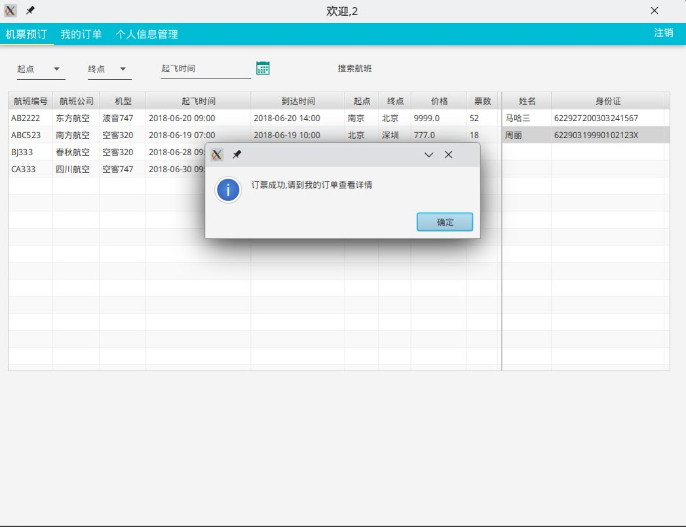

**注册账号**：首次使用需要注册账号。点击"立即注册"进入注册界面。

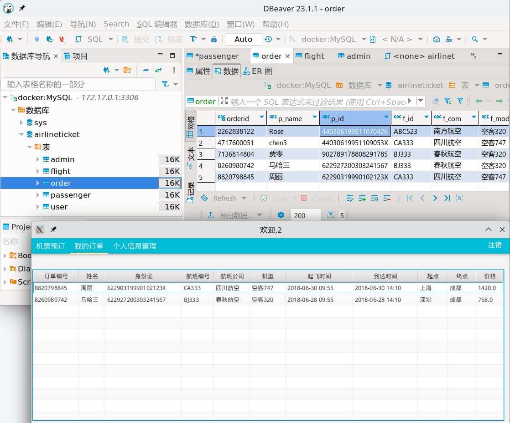

**注意事项**：
- 注册前需要阅读并同意使用条款和隐私声明
- 所有字段都需要正确填写
- 密码需要符合安全要求

#### 2. 忘记密码

如果忘记密码，可以通过身份证号找回：

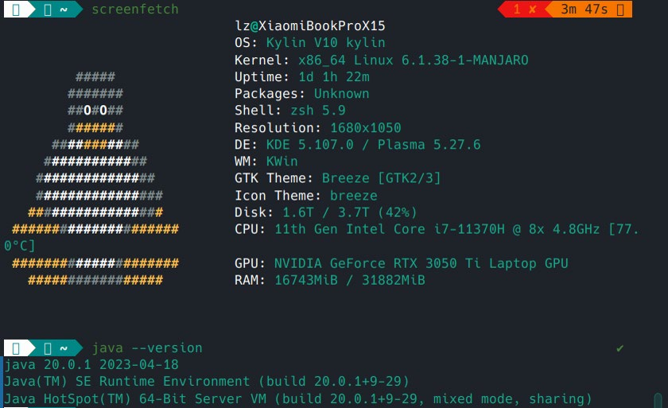

#### 3. 航班查询与预订

登录成功后进入机票预订主界面：

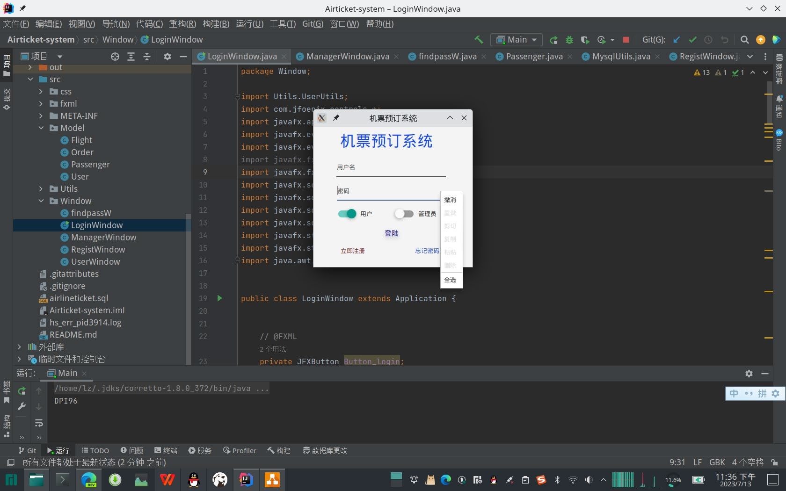

**预订流程**：
1. 在右侧添加乘客信息（支持多位乘客）
2. 在左侧选择合适的航班
3. 右键点击航班选择"购票"完成预订

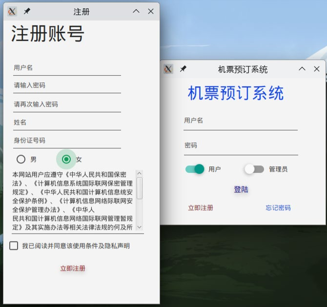

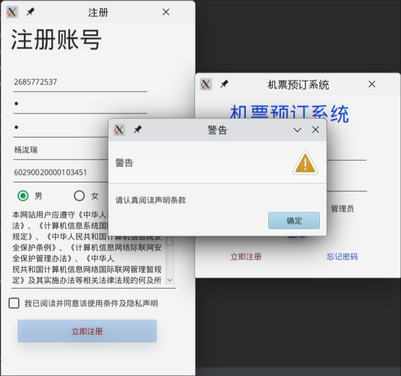

#### 4. 航班搜索

支持多种搜索方式：
- 按起飞地搜索
- 按目的地搜索
- 按起飞时间搜索

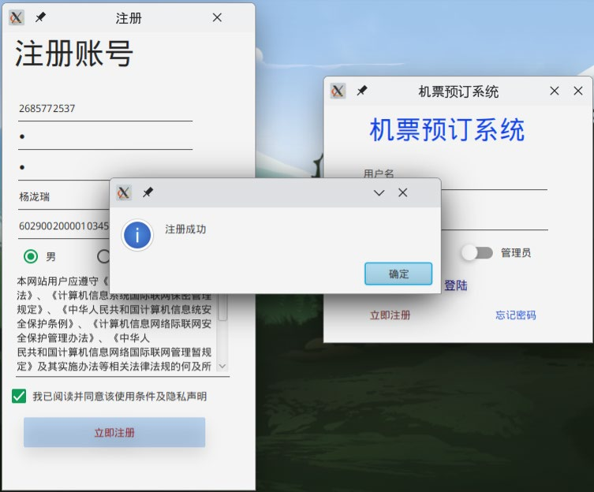

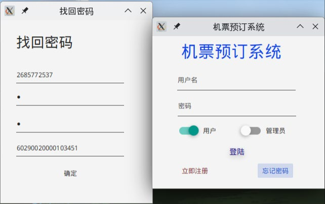

#### 5. 订单管理

在"我的订单"面板可以查看已购机票和退订：

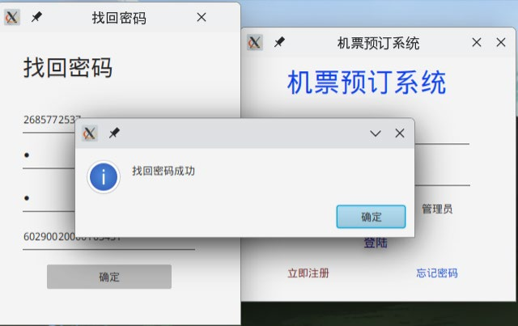

#### 6. 个人信息管理

在个人中心可以查看和修改个人信息：

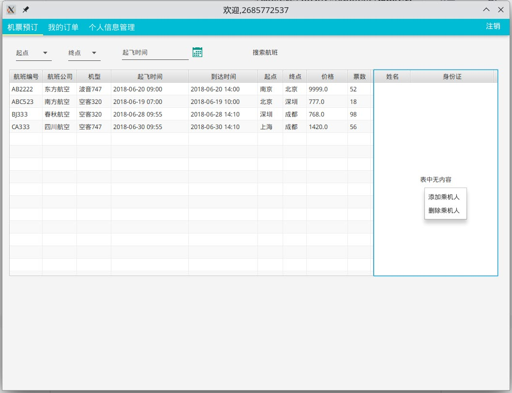

### 管理端操作

#### 1. 管理员登录

切换为管理员账号登录：

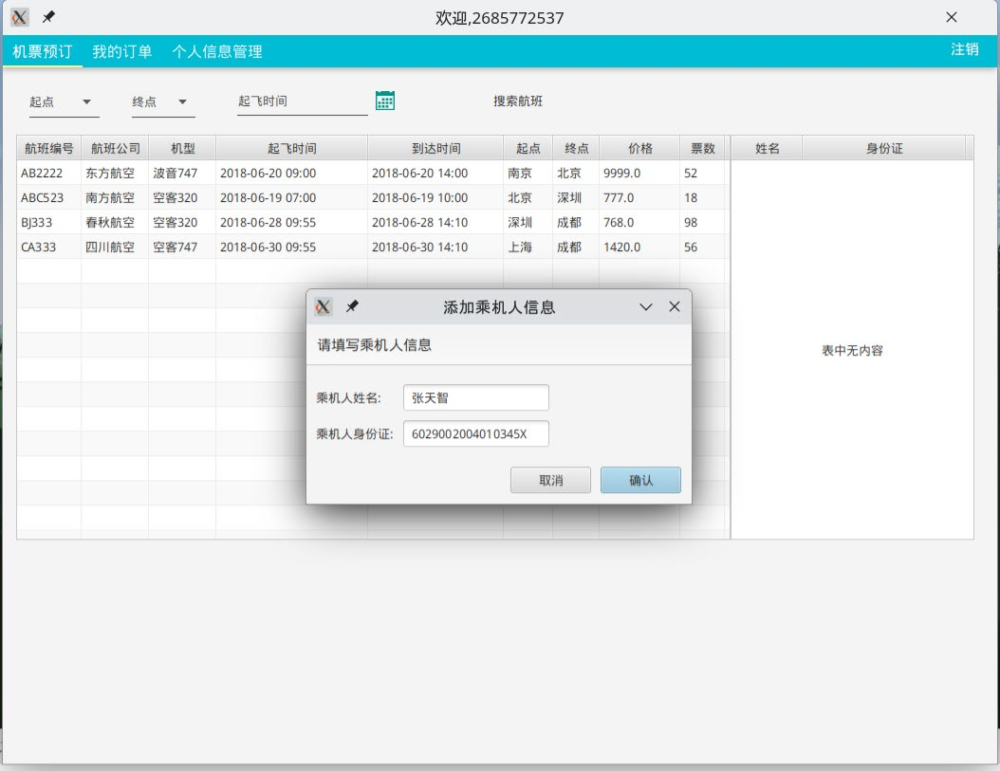

#### 2. 管理界面

管理员主界面提供航班管理、用户管理、订单管理等功能：

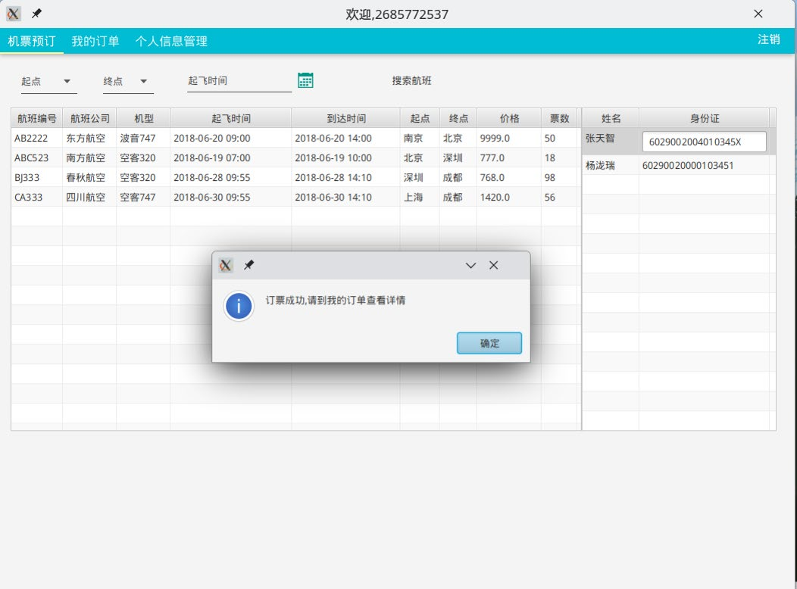

**快捷操作**：
- 双击单元格直接编辑
- 回车键确认修改
- 右键菜单进行增删操作

#### 3. 用户管理

管理所有用户账号信息：

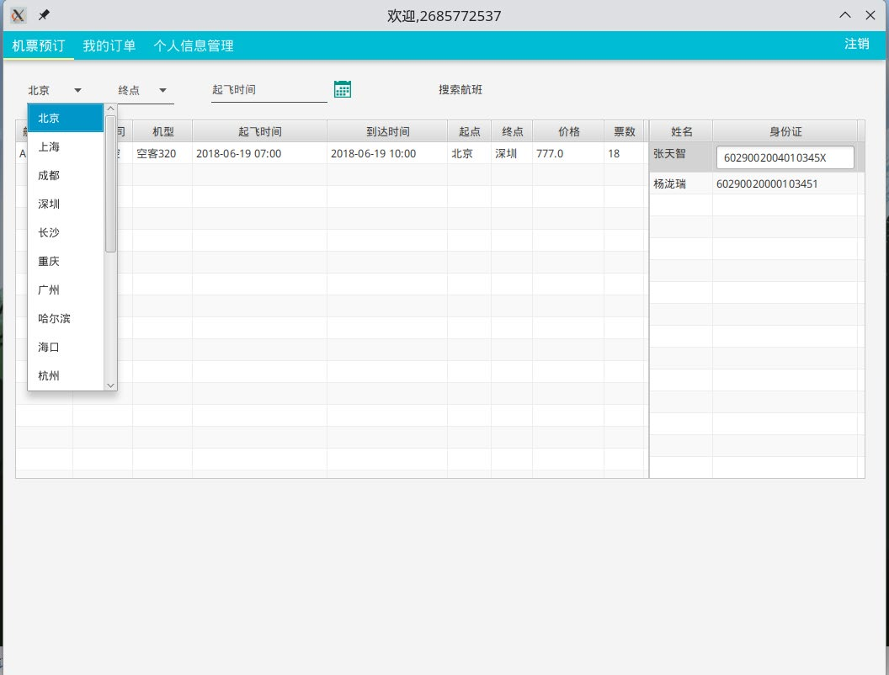

#### 4. 订单管理

查看和管理所有订单：

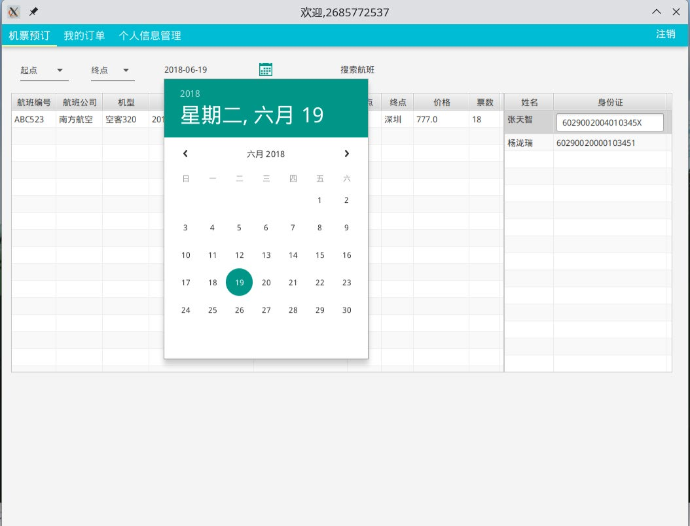

## 🗄️ 数据库设计

### 数据库表结构

#### 1. 用户信息表 (user)
| 字段名 | 类型 | 说明 | 约束 |
|--------|------|------|------|
| username | VARCHAR(50) | 用户名 | 主键 |
| password | VARCHAR(50) | 密码 | 非空 |
| name | VARCHAR(50) | 姓名 | 非空 |
| sex | VARCHAR(10) | 性别 | 非空 |
| identity | CHAR(18) | 身份证号 | 唯一 |
| phone | CHAR(11) | 电话 | - |
| email | VARCHAR(50) | 邮箱 | - |

#### 2. 航班信息表 (flight)
| 字段名 | 类型 | 说明 | 约束 |
|--------|------|------|------|
| fid | CHAR(10) | 航班号 | 主键 |
| start | VARCHAR(20) | 起飞地 | 非空 |
| dist | VARCHAR(20) | 目的地 | 非空 |
| stime | DATETIME | 起飞时间 | 非空 |
| etime | VARCHAR(20) | 飞行时间 | 非空 |
| model | VARCHAR(20) | 机型 | 非空 |
| price | FLOAT | 票价 | 非空 |
| left | INT | 剩余座位 | 非空 |

#### 3. 乘客信息表 (passenger)
| 字段名 | 类型 | 说明 | 约束 |
|--------|------|------|------|
| id | CHAR(18) | 身份证号 | 主键 |
| name | VARCHAR(50) | 姓名 | 非空 |

#### 4. 订单信息表 (orders)
| 字段名 | 类型 | 说明 | 约束 |
|--------|------|------|------|
| oid | INT | 订单号 | 主键，自增 |
| fid | CHAR(10) | 航班号 | 外键 |
| pid | CHAR(18) | 乘客身份证号 | 外键 |
| price | FLOAT | 价格 | 非空 |

### 实体关系

系统主要包含以下实体及其关系：


- **旅客** (Passenger)：姓名、身份证号、联系方式、性别
- **航班** (Flight)：航班号、起飞地、目的地、起飞时间、飞行时间、机票价格、剩余座位
- **订单** (Order)：订单号、航班号、旅客身份证号、价格
- **用户** (User)：用户名、密码、姓名、性别、身份证号、电话、邮箱

## 📸 系统截图

### 用户端界面

<details>
<summary>点击展开查看更多截图</summary>

#### 登录与注册


#### 航班预订


#### 航班搜索


#### 订单管理


#### 个人中心


</details>

### 管理端界面

<details>
<summary>点击展开查看更多截图</summary>

#### 管理主界面


#### 用户管理


#### 订单管理


</details>

## 🧪 测试

### 测试方法

本系统采用**黑盒测试**方法，主要验证系统功能是否符合预期。

### 测试用例

#### 用户购票测试

| 姓名 | 身份证号码 | 预期结果 |
|------|-----------|---------|
| 马哈三 | 622927200303241567 | 购票成功 |
| 周丽 | 62290319990102123X | 购票成功（含X） |

### 测试结果

系统测试通过，主要验证了：
- ✅ 用户注册、登录功能正常
- ✅ 航班查询功能准确
- ✅ 机票预订流程完整
- ✅ 订单管理功能正常
- ✅ 管理端各项功能正常
- ✅ 支持含"X"的身份证号码
- ✅ 数据一致性验证通过

## 📄 许可证

本项目采用 MIT 许可证。这意味着：

- ✅ 可以自由使用、复制、修改、合并、发布、分发、再许可和销售软件
- ✅ 可以用于商业目的
- ⚠️ 需要在副本中包含版权声明和许可声明
- ⚠️ 软件按"原样"提供，不提供任何形式的明示或暗示保证

查看 [LICENSE](LICENSE) 文件了解更多详情。

## 📚 参考文献

1. 郭继展. 黑盒法调试程序[J]. 计算机应用研究, 1990(04):2-5.
2. 吴晓周. 软件测试综述[J]. 软件导刊, 2009, 8(05):5-6.
3. 韩若冰. 机票预定系统的设计与实现[D]. 厦门大学, 2014.
4. 王珊, 萨师煊. 数据库系统概论(第5版)[J]. 中国大学教学, 2018, No.333(05):100.
5. 孙晓雨, 顾兆军, 杨宇. 基于数据库连接池技术的机票信息提取系统[C]//交通运输类院校研究生学术论坛. 2010.
6. 谷震离. 用软件工程的方法实现对机票管理系统的开发与设计[J]. 许昌学院学报, 2001, 020(005):76-80.

## 🤝 贡献

欢迎提交 Issue 和 Pull Request！

## 👨‍💻 作者

- 项目作者：longzheng268
- 指导教师：王燕老师
- 学校：兰州理工大学 计算机与通信学院

## 📞 联系方式

如有问题或建议，欢迎通过以下方式联系：

- GitHub Issues: [提交问题](https://github.com/longzheng268/Air-Ticket-Reservation-System/issues)
- Email: 通过 GitHub 个人主页联系

---

**感谢使用机票预定系统！** ✈️

*本项目为数据库综合训练项目，仅供学习交流使用。*
